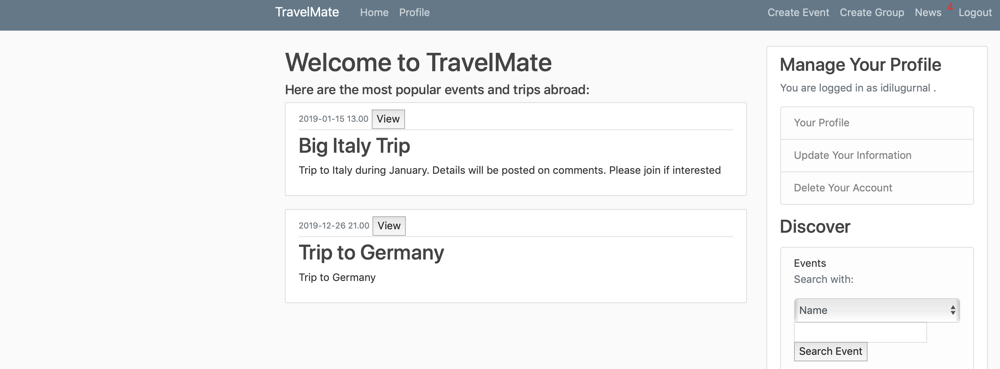

Welcome to itucsdb1834's documentation!
=====================================

:Team: TravelMate

:Members:

   * Cagla Kaya
   * Idil Ugurnal
   

TravelMate is a website that connects people with same standards, interests and goals and makes it possible for them to accompany each other to desired travels, events. It is also possible to create groups or join to groups with people that you wish to attend to common events. You can even create requests for small or personal events to see if there will be enough attention to turn it into an actual event. You are notified immedeately by anything that you are interested on this website. This makes it easy to follow events and groups that you are interested to hear from.

Python and Flask Libraries are used to develop this web application. Relational databases are used to store information. PostgreSQL is used to store the data necessary on the website. 

Contents:

.. toctree::
   :maxdepth: 2

   user/index
   developer/index
