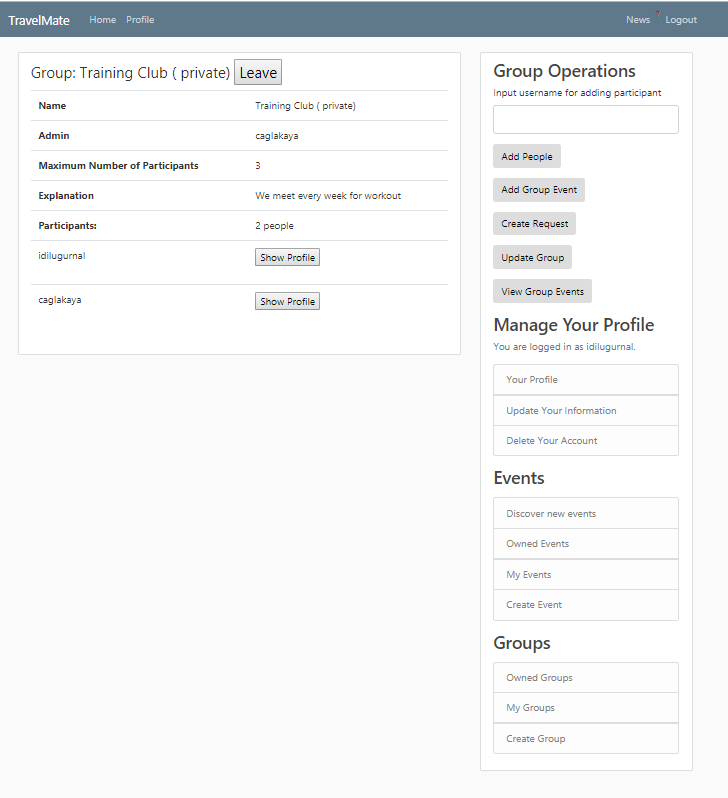

Parts Implemented by Cagla
================================

Create Group
--------------
You can create groups to plan new events with the same people.

  .. figure:: pics/create_group.PNG
   :scale: 70 %
   :alt: Create Group 

Group Views
--------------
Hear owned groups of an user:

 .. figure:: pics/owned_groups.PNG
   :scale: 70 %
   :alt: Owned Groups
   
Group members will have more permissions for operations at group if owner of the group gives permission to the other members of group to alter group information. And only the owner of the group is allowed to delete people from group or delete group completely. 

View For Owner
^^^^^^^^^^^^^^^^

  .. figure:: pics/group_owner.PNG
   :scale: 70 %
   :alt: Group Owner
 
At the figure above owner of group added a new member to the group. (Since group is private only member of group can add  people and there is only owner in the group at the begining)

View For Authorized Member
^^^^^^^^^^^^^^^^^^^^^^^^^^^^
Although members of the group are authorized they can not delete the particapants or the group.

Search Group
^^^^^^^^^^^^^^
A user can search for groups if group is public (is open to search and join). At the figure above, groups with a name that contains text 'training' is searched.

  .. figure:: pics/searched_groups.PNG
   :scale: 70 %
   :alt: Found Groups

Join Group
^^^^^^^^^^^^^^
If a user is not already member of the found group, can join the group.

  .. figure:: pics/join_group.PNG
   :scale: 70 %
   :alt: Join Group

View For Unauthorized Member
^^^^^^^^^^^^^^^^^^^^^^^^^^^^^^
Since the members of the joined group other than the owner are unauthorized,they can only view group events, create request and leave the group.

  .. figure:: pics/unauthorized_group_member.PNG
   :scale: 70 %
   :alt: Unauthorized Group Member
