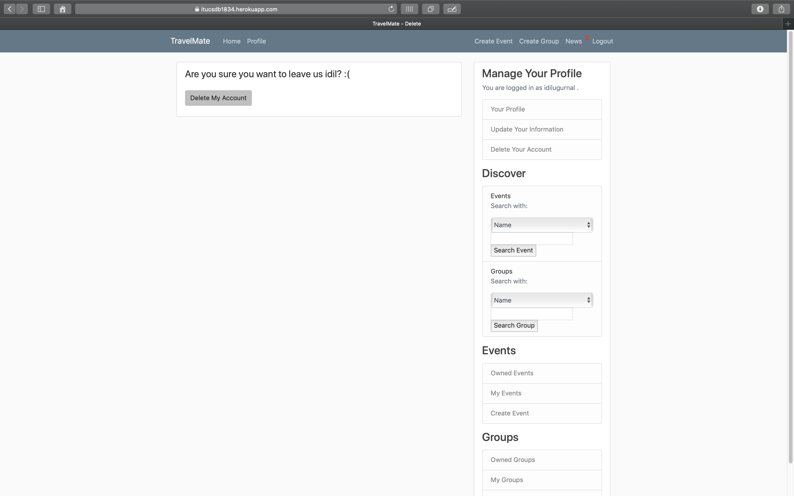
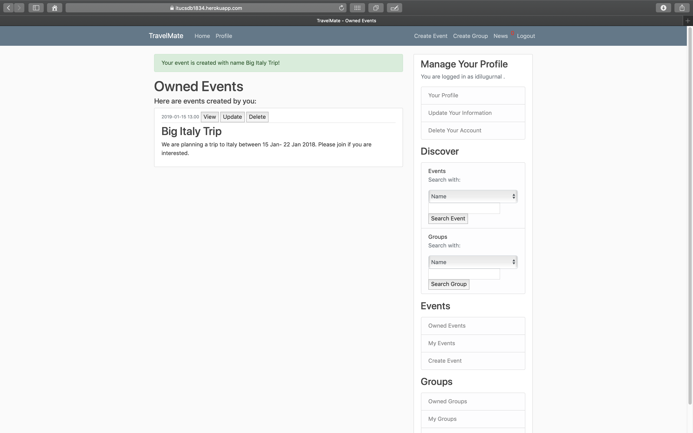

Parts Implemented by Idil
================================

Create Account
----------------
You can register to our website by clicking register on the navigation bar.

  .. figure:: pics/register.png
   :scale: 50 %
   :alt: Create Account 

Update Profile
----------------
When you are registering we only get some important key information to save you as a user. After your account is created, you can update your information under manage your profile and add personal information to complete your profile.

.. figure:: pics/update_profile.png
   :scale: 50 %
   :alt: Update Profile

Delete Account
---------------
If you wish to delete account, you can delete it under manage your profile on the side bar.

Create Event
--------------
On the navigation bar, you will see "create event" option. You can easily access the page there and create your event rapidly.

.. figure:: pics/create_event.png
   :scale: 50 %
   :alt: Create Event

View Update and Delete Event
-------------
Update and Delete operations can be done on the menu bar above the event.

Search For Events
-----------------
On the navigation side by you can search events with the properties you choose from the drop-down menu.

.. figure:: pics/search_event.png
   :scale: 50 %
   :alt: Search Event

Notifications
---------------
Notifications can be seen on the navigation bar at the top. If you have unread notifications, it will show the color in red.

.. figure:: pics/news.png
   :scale: 50 %
   :alt: News
